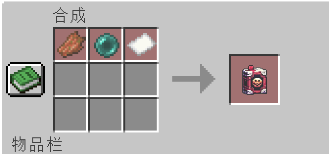

## 1.20.4.3 beta6.1:

### 修复bug:

紧急修复潜行+右键会吞抽卡道具的bug

## 1.20.4.3 beta6:

### 新增:

### 新系统:抽卡系统.
### 新物品:梦境之钥,星辰之诺,赌狗镐,反物质镐,星辰之石,复制者,浩瀚之星,时空碎片,时空宝石,时空矿石,时空工具组合,死亡卷轴,下界合金锤.
### 新附魔:教育,强化锋利,亡灵杀手,节肢杀手,强化力量.

### 抽卡系统:

使用梦境之钥,星辰之诺抽卡.  
抽卡概率同隔壁某二字游戏,还有不知道多少字的游戏.  
9个可以合成一个十连抽(官方九折!)  
两个物品分别代表不同的卡池.  
使用潜行＋右键查看对应物品卡池.  
两个卡池可以随时切换(合成兑换).  

### 新物品:

#### 梦境之钥:
  
抽卡材料.  
  

#### 十连梦境之钥:
  
可以抽卡十次!  

#### 星辰之诺:  
  
抽卡材料.  
挖掘星辰之石掉落.  

#### 十连星辰之诺:
  
可以抽卡十次!  

#### (tips:抽卡物品可以互相转化.)

#### 赌狗镐:
  
挖掘任何一个方块,开始你的豪赌!  
所有,或者一无所有!  
挖掘有50%概率掉落多倍原本掉落物品,还有可能啥也不掉!!  
仅能通过抽卡获得.

#### 反物质镐:
  
挖掘任何一个方块,开始你的豪赌!  
所有,或者一无所有!  
挖掘随机掉落所有物品之一.  
仅能通过抽卡获得

#### 星辰之石:  
  
需要5级的挖掘等级.  
极少数的出现在地下-64~-48层之间.  
挖掘后掉落星辰之诺.

#### 时空矿石:
  
产生在末地的矿物.  
挖掘掉落时空碎片.
在末地低于20层的位置产生.  

#### 复制者:
  
可以复制绝大多数物品一次.  
但只能复制最基础的,无法继承nbt.  
由于力量的缺失导致某一些物品无法被复制.  

#### 浩瀚之星:
  
抽卡掉落的副产物.  
五个可以合成一个梦境之钥.  

#### 时空碎片:
  
时空矿石的掉落物.
合成物品.

#### 时空宝石:
  
新材料.  
由两个时空碎片合成.
  
可以升级下界合金装备.

#### 时空工具组合:

  
基础攻击力:10,攻速:1.6,耐久:2568,挖掘速度:12,挖掘等级:5.  
beta:与下界合金锤和时空宝石与原下界合金工具合成.
  
todo: 可以继承附魔效果/在锻造台锻造.

#### 死亡卷轴:
  
可以回到上次死亡的位置.
  

#### 下界合金锤:
  
合成材料.  

#### 无限火箭:
可以无限放飞的火箭!!!  
不绑定人!!!

### 新附魔:

#### 强化锋利,亡灵杀手,节肢杀手,力量:

均为原版加强版.有大幅度的增强.

#### 教育:

怪物掉落更多的经验值. 额外掉落等级*原本经验值.

## 1.20.4.3 beta5.2:

巨幅优化物品分类者性能开销.

## 1.20.4.3 beta5.1:

修复物品分类者致命错误.

## 1.20.4.3 beta5:

### 新增:

新物品:物品分类者.  
新增服务器统计:在线时间(分钟),破坏方块数量,造成与伤害生物血量.

#### 物品分类者:
  
合成配方:由粘性活塞,末影珍珠,标靶,岩浆桶,红石块,发射器,红石比较器,木桶,漏斗矿车合成.
  
使用方法:  
将其放在**需要分类**的箱子**下面**(必须是下面),并给物品分类者一个**红石信号**.  
他便会自行搜索范围**50格**内的箱子(日后可修改,开销过大暂时无法修改),且搜寻挂在箱子上的**物品展示框**(荧光物品展示框均可)内的物品.  
若物品相同,则自动分类到此箱子内.  
若物品不相同则不会分类.  
性能问题:  
在周围的箱子不是直接就会被识别,需要经过5~10s左右才会被识别.  
若你发现给红石信号了周围也有符合的箱子而物品没被分类,则需要等待一小会即可.  
建议**一个(大)箱子**只放**一个**物品展示框,若想一个箱子放多个物品也可以放多个物品展示框,_**~~就是出问题别找我~~**_(笑).

## 1.20.4.3 beta4:

### 新增:

#### 新增物品:

天使方块框架,1~9级压缩铜锭,神圣之羽.

#### 新增特性:

在动力铁轨下放红石块,可以使其最大速度从8m/s提升至20m/s.  
玩家死亡后,会有一定概率掉落自身的头颅.(需要自己放下然后撸掉后显示(懒)).   
todo:将原版base64加密解密赋值在nbt上.

#### 新增合成:

天使方块,天使方块框架,神圣之羽,1~9级压缩铜锭.

#### 新增一些统计.

##### 物品:
###### 天使方块框架:
合成材料.  
使用三个钻石块,两个下界合金块,两个龙首,一个重生锚,一个六级压缩铜锭合成.(图文不符,以文字为准.)

###### 神圣之羽:
合成材料.  
使用一个末影珍珠,一个羽毛,一个下界合金碎片,一个下界之星,一个附魔瓶,两个紫水晶碎片合成.

###### 压缩铜锭:
每级压缩铜锭合成需要下级压缩铜锭4个,可反向合成,1级需要4个铜锭.

##### 合成:
天使方块:  
使用一个天使方块框架,两个神圣之羽,一个天使方块核心,三个蜜脾合成.

天使之翼核心:  
使用4瓶龙息,两个末地水晶,两个鞘翅与一个下界之星合成.

### 修复:

修复磁铁在其他新增物品后失效的问题.

### 移除:

移除村民移动者的合成配方.

## 1.20.4.3 beta3:

### 新增:

与GeyserAPI进行联动,识别手机玩家,并给予手机玩家更方便的操作/优势.  
新增效果:天使之翼.  
新增方块:天使方块.  
新增物品:磁铁,天使之翼核心.  

#### 天使方块:

功能性方块,在附近的玩家可以获得天使之翼的效果.  
所有生物可以穿过这个方块.  
暂无获取方式,暂无破坏方法(是op即可一下破坏,无论生存创造),防炸.

#### 天使之翼:

获得飞行功能,可以像创造模式一样飞行.

#### 磁铁:

耐久度:350                                          
使用两个铁块,两个红石块与3个铁锭合成.  
右键可以开启与关闭,开启后将吸取附近10格范围内可拾取的物品.  
潜行加右键可以开启或关闭被吸取物品的粒子效果.   

#### 天使之翼核心:

合成材料.  
暂无用处.  

## 1.20.4.3 beta2:

### 新增:

新增物品:村民移动器(短暂存在).

#### 村民移动器:

顾名思义,移动村民用的.  
手持此物品对村民右键即可.  
使用一个绿宝石合成.

## 1.20.4.3 beta1:

### 新增:

新增物品:灵魂石.  
新增合成表:光源方块.  
新增状态效果:龙吼,断愈.  
新增武器:龙剑,星光魔杖.

#### 灵魂石:

  
(测试物品.)  
由4个钻石,4个绿宝石与一个下界之星合成.  
对驯服的生物使用, 绑定他的灵魂,使此生物死去也可以复活!  
对着绑定的狗狗蹲下+使用可以取消绑定.  
死亡时,他会发送一条通知告诉您,请切记这个灵魂石要在您的身上,否则无法生效哦~  
使用之后,会有120s的cd,无法再次使用此灵魂石复活.  
若该生物未死亡,则在半径40格内搜寻此生物,并使其发光.  
暂时只支持**狼**.  
todo:支持更多生物,生物死亡时灵魂石无需在身上.

#### 合成表:

使用一个火把即可合成一个光源方块.  
移除了光源方块要求创造且是op才能切换的规定.  
即你可以在生存模式下修改光源方块亮度,且与创造模式一样拥有提示.  
手持光源方块即可破坏,破坏固定掉落15亮度的光源方块.

#### 龙剑:

  
传奇武器.  
攻击伤害:8,攻击速度:1.6.  
使用右键,消耗当前30%生命值,触发龙吼.  
持续10s,CD:16s,切换武器后失效.

#### 星光魔杖:

  
传奇武器.  
右键使用星辉之力:  
Cd:30s,持续时间:10S,给予附近的生物10s断愈效果,且造成8点伤害.  
给自己的宠物恢复8点生命值!  
蹲下则对玩家也生效!

#### 龙吼:

  
状态效果.  
增加4额外攻击力,增加50%攻速与30%移动速度.  
缓慢回复生命值.统共回复生命值上限20%.(每5ticks恢复一次,即每次恢复0.5%生命值上限生命.)  
仅能通过龙剑获得.

#### 断愈:

  
状态效果.  
禁止治疗,在效果结束时恢复所有在效果**持续期间**恢复的血量.

### 修复:

电梯冷却状态效果图标消失问题.  
使用电梯音效消失的情况.  
灵魂绑定失效的bug.

### todo:

灵魂石无需在身上也可以触发.

## 1.20.4.2:

### 新增:

新增方块:电梯.  
新增物品:绿宝石苹果.  
新增状态效果:电梯冷却.  
新增统计:受到最大伤害,造成最大伤害,使用电梯上升,下降次数以及总次数.  
移除了原版属性(Attribute)最大上限.例如:原护甲值最高为30.

#### 电梯:

由8个铁块与1个末影珍珠合成.  
踩在电梯上时,使用跳跃向上传送,使用潜行向下传送.  
传送有**1s**的冷却(防止手机玩家频繁传送).  
使用镐子挖掘,硬度为4.

### 绿宝石苹果:

由8个绿宝石与1个苹果合成.  
吃下后回复6点饥饿值与12点饱和度.  
并给予3分钟夜视与3分钟急迫II效果,有40%的概率该效果升级为急迫IV.  
可以对村民使用:  
村民也将获得以上药水效果.  
村民将立刻随机补货一种交易**已达上限**的货物.  
恢复村民4(2❤)的血量.  
消除村民"受到攻击"的言论.

### 修复:

修复连锁挖矿在附魔台的获取难易度.  
修改modid,以免发生不对的问题.

### todo:

增加配置文件.

## 1.20.4.1:

去除铁砧附魔40级上限.  
使无限与经验修补兼容.  
新增:/removelore 一键去除身上的物品的lore信息.  
新增附魔:灵魂绑定,连锁挖矿.

### 灵魂绑定:

死亡时,该物品不会掉落.无法通过附魔台获得.

### 连锁挖矿:

快捷键:`或~  
顾名思义,一键挖取矿物,挖取的个数为 16 * 等级.  
使用会额外增加疲劳度,增加的疲劳度为: 0.7 - 等级 * 0.1 /方块  

